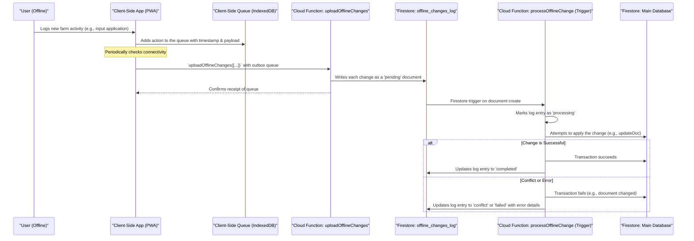

# Advanced Offline Synchronization Strategy for DamDoh

This document outlines a robust strategy for handling offline data, a critical feature for users in areas with intermittent or unreliable internet connectivity. This goes beyond Firestore's default caching to provide a reliable, auditable, and conflict-managed synchronization system.

## 1. Core Principles

-   **Certainty:** The user must be 100% confident that data entered offline is safe and will be synced.
-   **Auditability:** The system must maintain a log of offline changes, their application status, and any conflicts.
-   **Conflict Resolution:** A clear strategy must be in place for when offline data conflicts with data updated on the server.
-   **User Experience (UX):** The app must clearly communicate its offline/online status and the state of the sync queue.

## 2. Architecture: The "Outbox" Pattern

We will implement an "Outbox" pattern. All data modifications (creates, updates, deletes) made while offline are not attempted directly. Instead, they are saved to a persistent client-side queue (the "outbox"). When connectivity is restored, the outbox is sent to a secure backend function for processing.



## 3. Client-Side Implementation

### 3.1. Data Persistence: IndexedDB

For a web-based application (including a PWA), **IndexedDB** is the recommended solution. It offers:
*   Large storage capacity (often several GBs).
*   Transactional support to ensure data integrity.
*   Asynchronous API that doesn't block the main UI thread.
*   Widespread browser support.

A library like **`Dexie.js`** can be used to simplify IndexedDB operations.

### 3.2. Service Worker Strategy

A Service Worker is essential for a reliable offline experience.
*   **Precaching:** On first install, the Service Worker will cache the application shell (HTML, CSS, core JS).
*   **Runtime Caching:** It will cache static assets (like images, icons) and API responses (like the list of farms) as they are requested, using a `StaleWhileRevalidate` or `CacheFirst` strategy.
*   **Offline Google Analytics:** It can queue analytics events to be sent when online.
*   **Background Sync:** The `BackgroundSync` API can be used to trigger the upload of the outbox even if the user has navigated away from the page.

Libraries like **Workbox** will be used to simplify the implementation of these strategies.

## 4. Backend Implementation (Cloud Functions)

### 4.1. The Change Log (`offline_changes_log` collection)

Each document in this collection represents a single atomic change from a client.

**Schema:**
```json
{
  "changeId": "unique_id",
  "userId": "firebase_auth_uid",
  "timestamp": "client_generated_timestamp", // Crucial for conflict resolution
  "collectionPath": "e.g., 'farms' or 'crops'",
  "documentId": "target_document_id",
  "operation": "create | update | delete",
  "payload": { ... }, // The data for the create/update
  "status": "pending | processing | completed | conflict | failed",
  "createdAt": "server_timestamp", // When it was received by the server
  "processedAt": "server_timestamp", // When processing finished
  "errorMessage": "Details of why it failed"
}
```

### 4.2. Conflict Resolution Strategy

For the DamDoh platform, a **Last-Write-Wins based on Client Timestamp** strategy is recommended as the default.

*   **Logic:** When the `processOfflineChange` function attempts to update a document, it will first read the document's `updatedAt` timestamp from the server.
    1.  It compares the `timestamp` from the offline change log entry with the server's `updatedAt`.
    2.  **If `client_timestamp` > `server_updatedAt`**: The client's change is newer. The transaction proceeds.
    3.  **If `client_timestamp` <= `server_updatedAt`**: The server has a more recent version of the data. The transaction is aborted, and the change log entry is marked as a `conflict`.

*   **Why this works:** This respects the user's intent—the last action they remember taking is the one that should win. It's simple and avoids complex data merging which could lead to corruption.
*   **Handling Conflicts:** The client application will be responsible for subscribing to its user's `conflict` logs. When a conflict is detected, the UI must notify the user, show them the conflicting data, and allow them to manually resolve it (e.g., "The notes for this crop were updated on the server while you were offline. Do you want to overwrite them with your version?").

## 5. User Experience (UX)

*   **Clear Status Indicator:** The UI must always display a clear indicator of whether the app is online or offline.
*   **Sync Queue Visibility:** A small icon in the UI should show the number of pending changes in the outbox. Clicking it could reveal the list of queued actions and their status (pending, syncing, conflict).
*   **Read-Only Mode:** Features that absolutely require a connection (e.g., searching the global marketplace) should be gracefully disabled with a message explaining why.
*   **Optimistic UI:** When a user performs an action offline, the UI should immediately reflect the change (e.g., adding the new item to the list) but with a visual cue (e.g., a "pending sync" icon) indicating it's not yet saved to the server. If a conflict occurs, this state is reverted and the user is prompted to resolve it.

This strategy provides a robust, scalable, and user-friendly offline experience essential for a global agricultural platform.