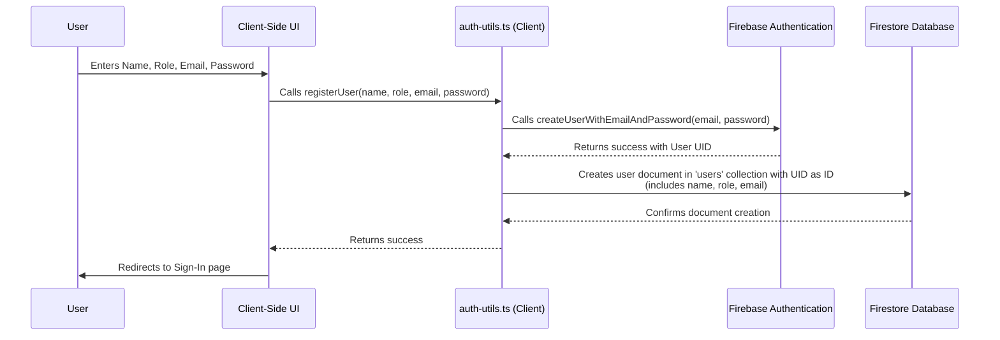
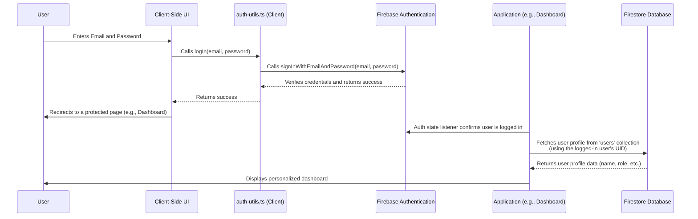

# DamDoh Authentication Data Flow

This document visually explains the data flow for the user Sign-Up and Sign-In processes, showing how the client-side application interacts with Firebase backend services.

## Sign-Up Flow

This process involves creating a user in **Firebase Authentication** for login credentials and simultaneously creating a corresponding profile document in the **Firestore database** to store user-specific information like name and role.

**Explanation:**
1.  The user fills out the form on the Sign-Up page.
2.  The form calls the `registerUser` function in our `auth-utils.ts` file.
3.  `registerUser` first tells Firebase Authentication to create a new user with the provided email and password.
4.  If successful, Firebase Auth creates the secure login account and returns a unique User ID (UID).
5.  `registerUser` immediately uses this UID to create a new document in our Firestore `users` collection, saving the user's name, role, and other profile information. The document's ID is the user's UID, creating a clear link.
6.  The user is then redirected, ready to sign in.

---

## Sign-In Flow

This process verifies a user's credentials against **Firebase Authentication** and, upon success, allows the application to know who the logged-in user is, so it can fetch their specific data from **Firestore**.

**Explanation:**
1.  The user enters their credentials on the Sign-In page.
2.  The form calls the `logIn` function in `auth-utils.ts`.
3.  `logIn` sends the credentials to Firebase Authentication for verification.
4.  If successful, Firebase Auth updates the auth state for the application.
5.  The user is redirected to a page like the Dashboard.
6.  The Dashboard page (or any other part of the app) now knows the user's UID and can use it to securely fetch that user's specific profile document from the Firestore `users` collection, allowing it to display personalized information.
